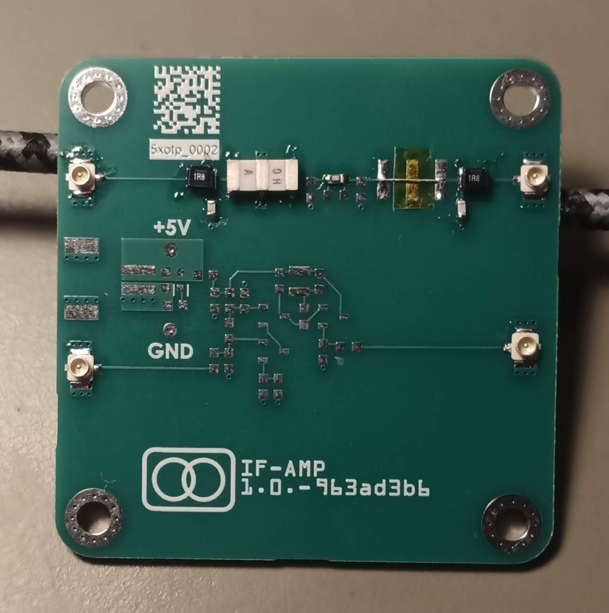
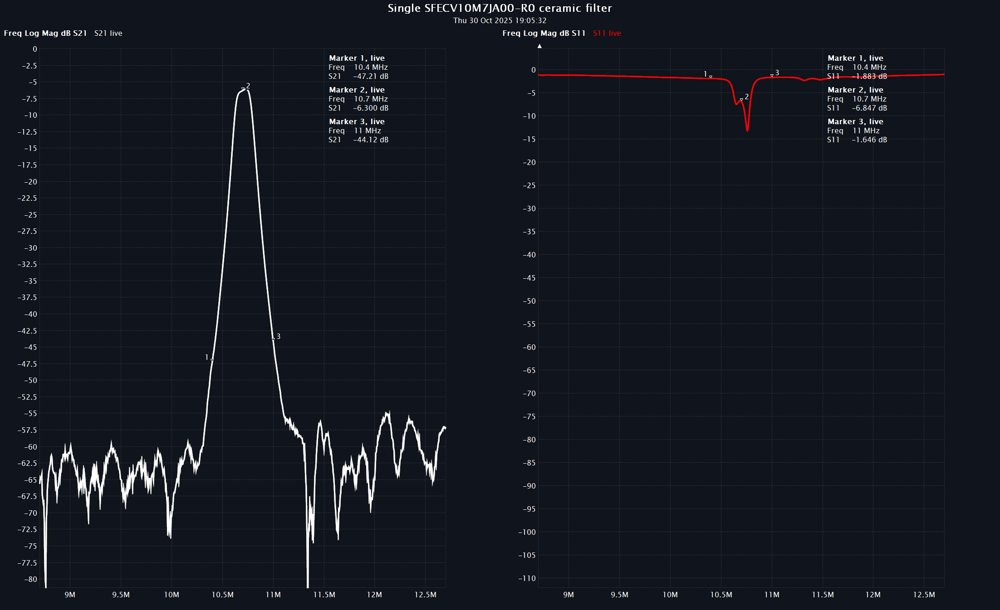
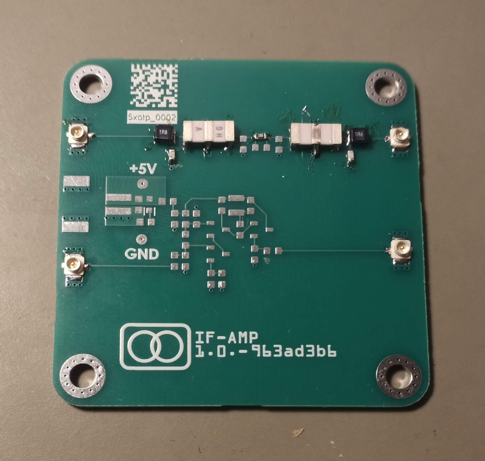
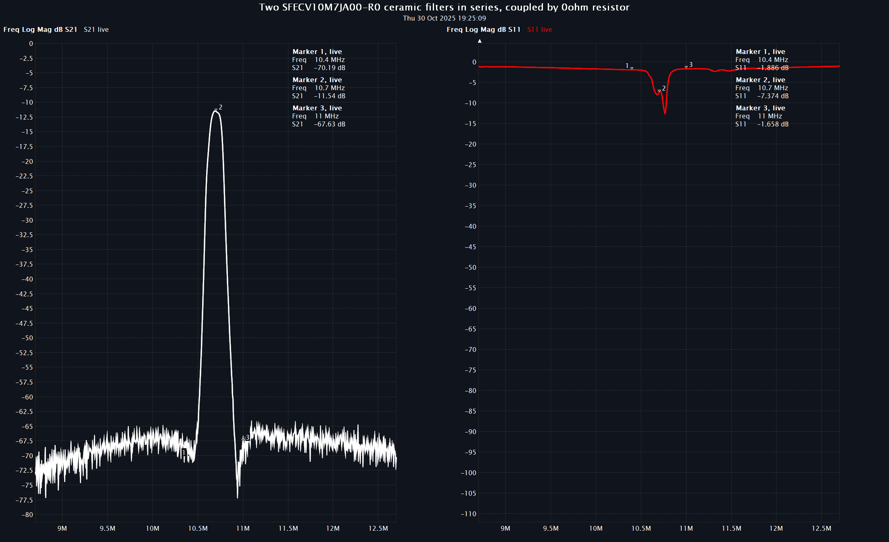

# Available Ceramic Filter: 150kHz is preferred
* Digikey : LTCV10.7MJ : 150kHz
* [RS Online](https://benl.rs-online.com/web/p/signal-filters/1062890) - Murata SFECV10M7JA00-R0 : 
  * 150kHz 
  * (obsolete)
  * 6.9 x 2.9 x 1.5mm
  * €1.32/pce excl. VAT

# Cascading Ceramic Filters
[Cascading SMD crystal filters ](https://www.reddit.com/r/rfelectronics/comments/npypxy/cascading_smd_crystal_filters/) suggests to use attenuators between the filters to improve out-of-band rejection.

# Measurements
## Single Filter
<figure>
    
    <figcaption>Single Crystal Filter</figcaption>
</figure>
<figure>
    
    <figcaption>Single Crystal Filter Measurement</figcaption>
</figure>
The attenuation at the center frequency is about 6dB, which is expected.

## Cascaded Filters
<figure>
    
    <figcaption>Cascaded Crystal Filters</figcaption>
</figure>
<figure>
    
    <figcaption>Cascaded Crystal Filters Measurement</figcaption>
</figure>

The attenuation at the center frequency is about 12dB, which is expected.  The attenuation at +/- 100kHz is more than 10dB.

# References
* [The FM Ceramic Filter Page](https://www.earmark.net/gesr/cf.htm)
* EMRFD : The Min-Loss Filter of Cohn and other Simplified Forms