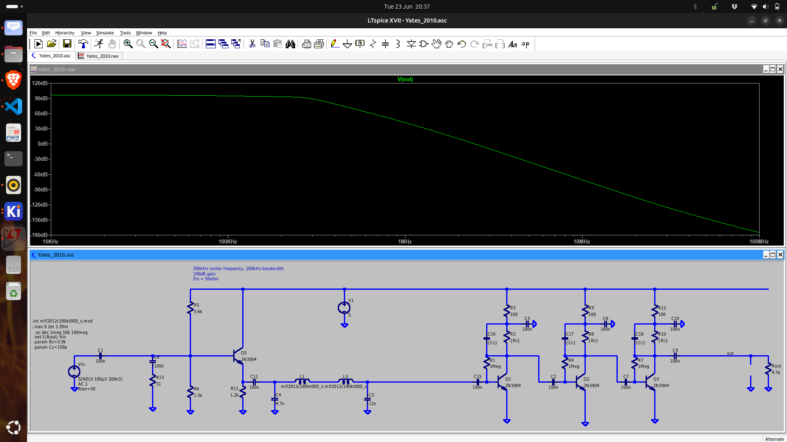

# Purpose
After mixing to IF2, which is around 200 kHz, the signal needs to be amplified and limited prior to be fed to the pulse count detector.

# Implementation
Several designs have been tried, but eventually a design based on [Yates 2010](./simulation/Yates_2010.asc) has been selected.  A Pi low pass filter has been inserted to steepen the drop-off.

# Input impedance
The input impedance drops from 60 Ohm at 80 kHz to 40 Ohm at 70 MHz.  

<figure>

<figcaption>AC-small signal simulation</figcaption>
</figure>

# References
* [Alan Yates' Laboratory - Pulse-Counting FM Broadcast Receiver](../detector/doc/pulsecount/Alan%20Yates'%20Laboratory%20-%20Pulse-Counting%20FM%20Broadcast%20Receiver.pdf)
* [Advent Calendar of Circuits 2014: Day 15: Pulse-Counting WBFM Receiver](https://youtu.be/lP3HltRJV6A)