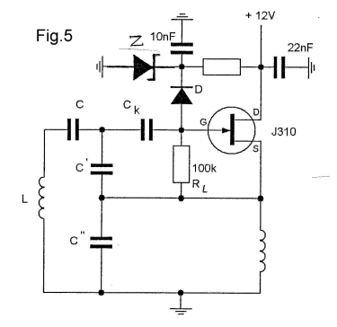
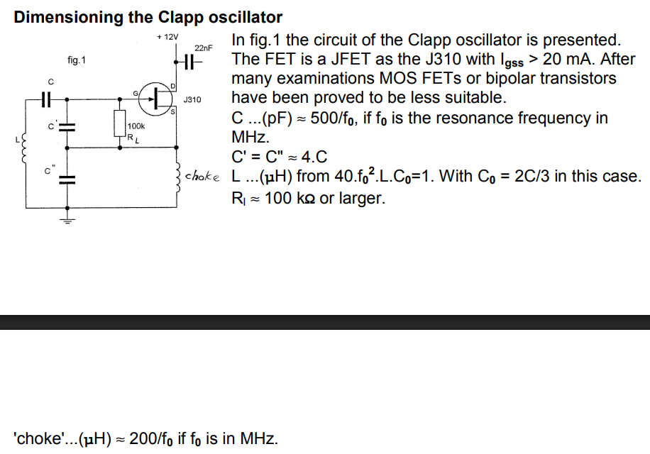
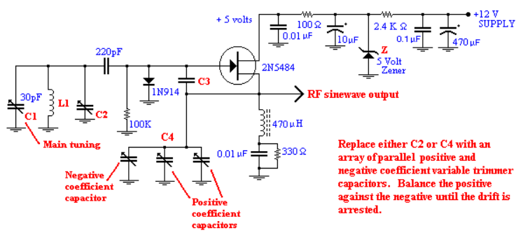
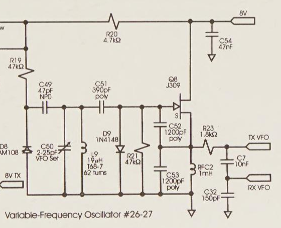
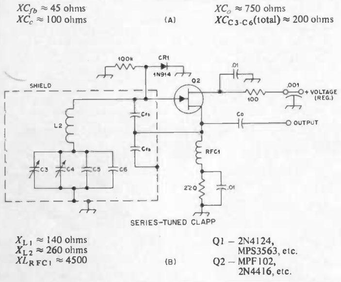
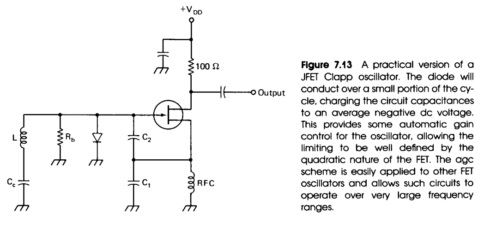
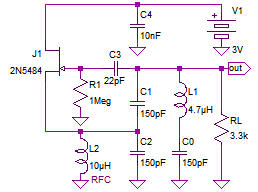

# Documentation
## Herbert Rutgers - Reproducible Low Noise Oscillators
<figure>
    
    
</figure>

[Reproducible Low Noise Oscillators, Herbert Rutgers, 2018](./doc/Herbert_Rutgers_Reproducible%20Low%20Noise%20Oscillators.pdf) : discusses why a diode to ground as on the designs below kills noise performance and what to do instead.  Contains also suggestions to component values.

1. The capacitive divider is connected to the tank circuit, on the left side of Ck.  It's a bit unclear to me what Ck is actually doing.  The capacitive divider can be connected to the right side of Ck.  As that is capacitive, it has no influence on the DC-bias.  Then Ck is in series with C, so it can be converted to a single capacitor.
2. The DC-voltage on the cathode of the LED has a big influence on the Vdg and Vgs voltage.  When that voltage is 5V, then the throughs of Vdg touch the peaks of Vgs.  The smaller the DC-voltage on the cathode, the smaller the Vdg and Vgs amplitudes.
3. It's unclear to me why the DC-bias of the JFET is taken from the top of the inductor instead of from ground.  There's not so much difference, but the output waveform is cleaner when connecting the resistor to ground instead.

## From Crystal Sets to Sideband - Frank W. Harris - Clapp Oscillator
<figure>
  
  <figcaption>Clapp Oscillator Schematic</figcaption>
</figure>

It uses the same Q-lowering compensation techniques as the references below : 1N914 diode on the JFET's gate and a resistor in series with the RFC.  It shows some interesting techniques for filtering the power supply.

The capacitive divider feeds back to the gate, on the right side of Ck (here 220 pF).

## The Electronics of Radio, David B. Rutledge - Clapp Oscillator
<figure>
  
</figure>

[The Electronics of Radio, David B. Rutledge, ch. 11, p.204](https://archive.org/details/electronicsofrad0000rutl) : includes analysis of a common-source Clapp oscillator, with a JFET as the active device.  The short version can be found [here](./doc/322Lecture24.pdf).

## Solid State Design for the Radio Amateur, W.Hayward - Clapp Oscillator
<figure>
  
  <figcaption>Clapp Oscillator Schematic</figcaption>
</figure>

There's no coupling capacitor between the tank circuit and the gate, which is directly connected to the junction of the capacitive divider.  

1. Clapp oscillator has larger inductor for the same frequency compared to Colpitts, so stray inductance is less of a problem.
2. Diode CR1 limits the oscillation amplitude.  Without it, the amplitude would be limited by the nonlinearity of the JFET, which would cause distortion and a less stable frequency.
3. It is wise to apply the least amount of operating voltage practical, but voltage should be larger than pinch-off voltage of the JFET (-4 V for a J309).

This material is also referenced in a [StackExchange](https://electronics.stackexchange.com/questions/718009/how-can-this-clapp-jfet-oscillate-when-its-gate-is-tied-to-ground-at-the-resonan) post.

## Introduction to Radio Frequency Design, W.Hayward - Clapp Oscillator
<figure>
  
</figure>
There's no coupling capacitor between the tank circuit and the gate, which is directly connected to the junction of the capacitive divider.  

This is a variation on which the output is taken from the drain instead of the source.  The RFC in the source sometimes has a resistor in series to lower its Q.

## Wikipedia - Clapp Oscillator
<figure>
  
</figure>

[Wikipedia Clapp Oscillator](https://en.wikipedia.org/wiki/Clapp_oscillator) : Common-source topology.

The output is taken directly from the tank circuit.  This seems odd.  By loading the tank circuit, the Q will drop and the oscillator will be noisy.

The gate is reference to ground through R1 and capacitively coupled to the tank circuit, as suggested by Rutgers.  

## Other Resources

* [JFET Colpitts Oscillator](https://community.element14.com/members-area/personalblogs/b/blog/posts/jfet-colpitts-oscillator)
  * includes bode plot
* [Clapp Oscillator - RF Cafe](https://www.rfcafe.com/references/qst/clapp-oscillator-february-1953-qst.htm) : analysis of the Clapp oscillator

