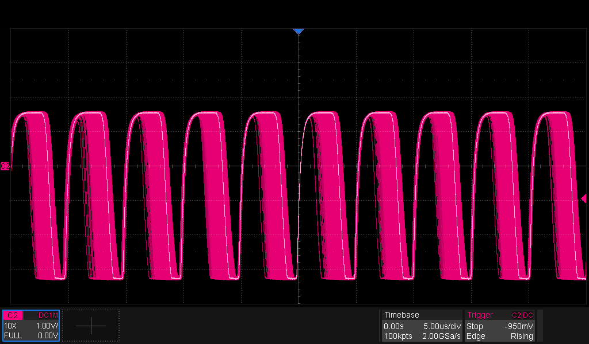
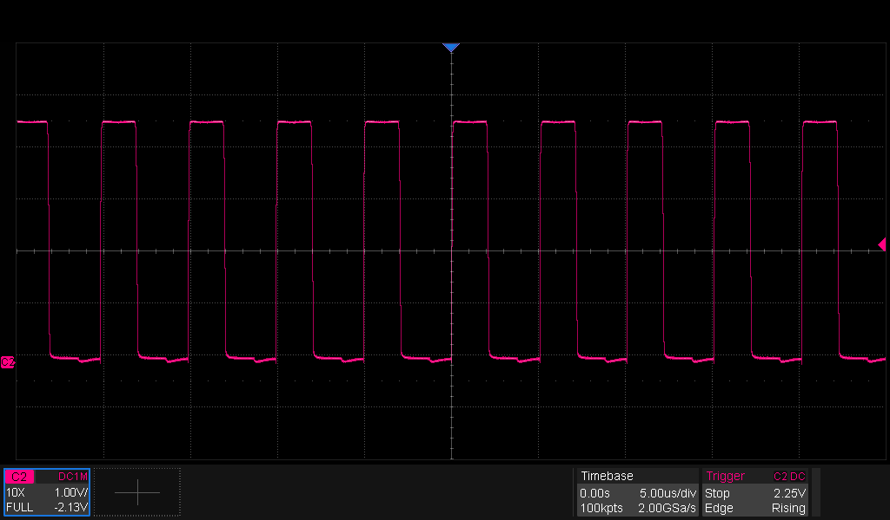
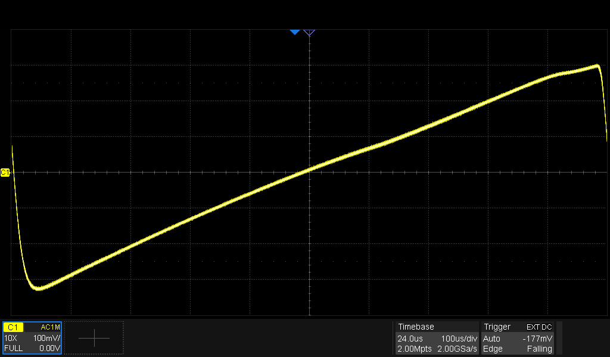

# Equipment

| Equipment | Description | Serial Number | Date of last calibration |
|-----------|-------------|---------------|--------------------------|
| Multimeter | Mastech M92 | 20011206033 | - |
| Multimeter | Fluke 8010A | 2047249 | - |
| Oscilloscope | Siglent SDS2354X HD |  SDS2HBAQ6R0257 | TBD |
| Power Supply | Siglent SPD3303C | SPD3EEEC6R0513 | TBD |
| Electronic Load | Siglent SDL1020X-E | SDL13GCC6R0182 | TBD |
| Spectrum Analyzer | ZeenKo ZS-406 | SU-406-25030820 | TBD |
| Function Generator | Siglent SDG2122X | SDG2XFBX901368 | TBD |

# Test Incident Reports

| Test | Incident | Proposed Solution | Status |
|------|----------|-------------------|--------|
| [TIR1](#tir1)<a id="ttir1"/> | zener voltage too low | replace R40 by 390 ohm |  |
| [TIR2](#tir2)<a id="ttir2"/> | output amplitude too low at least 2 Vpp is needed | Change C42 from 2 pF to 4 pF|
| TIR3 | simplification of amplifier | R13 = 0 Ω, C15 = 0 Ω, R15 = 3.9 kΩ | |
| [TIR4](#tir4)<a id="ttir4"/> | frequency response drops of audio filter off too rapidly |R26, R27, R29, R30 = 10K C28, C29,C32, C33 = 390pF| |
| [TIR5](#tir5)<a id="ttir5"/> | low frequency output heavily distorted | 1. Remove C8, C19 and C22 2. Retune IF_OSC for nice sine wave with 100 Hz modulating frequency. | |
| TIR6 | shielding is not very stable causes frequency shifting | solder two part shielding with separate lid | |
| TIR7 | oscillator frequency shifts with supply voltage | effect is limited and demodulating still works, but a 4V7 zener wouldn't hurt.|

# Test Results
## Local oscillator
| Action | Expected Result | Observed result | Status |
|--------|-----------------|-----------------|--------|
| V(D7)  | 3.0 V| 2.69 V|[🛑 TIR1](#ttir1)<a id="tir1"/>|
| V(R39) | 1.0 V| 0.56 V|✅  |
| V(R42) | 1.0 V| 0.89 V|✅  |
| Vpp(TP3) | 10 Vpp | 3.5 Vpp | | |
| Vpp(LO), 50 ohm load | 1.4 Vpp | 0.426 Vpp | |
| Vpp(LO), 1 Mohm load | 4.5 Vpp | 1.27 Vpp | [🛑 TIR2](#ttir2)<a id="tir2"/>|
| f(LO) | 10.5 MHz | 10.50 MHz after tuning | tuning was difficult because a trimmer with a 20 pF tuning range has been used. |

## Mixer
* IF Input = 10.7 MHz, -22 dBm
* Output = 
  * 200 kHz, -27 dBm
  * 10.7 MHz, -62 dBm 
  * 21.4 MHz, -80 dBm 

The oscillator bleed through at 10.7 MHz and 21.4 MHz doesn't change when the IF input level changes.  

## Buffer IF2_amp
| Action | Expected Result | Observed result | Status |
|--------|-----------------|-----------------|--------|
| V(Q1.B) | 1.47 V| 1.47 V|✅ |
| V(Q1.E) | 0.82 V| 0.807 V|✅ |
| V(C6) with LF_IN=-52dBm | > -57 dBm   Spectrum analyzer adds 50 ohm in parallel to C6 | - 55 dBm | ✅ |

10.7 MHz peak is lower than -100 dBm.

## IF2_amp_stage_I, II and III
| Action | Expected Result | Observed result | Status |
|--------|-----------------|-----------------|--------|
| V(Q8.B)| 0.641 V | 0.657 V| ✅ |
| V(Q8.C)| 2.60 V | 2.90 V| ✅ |
| V(C20) | 4.94 V | 4.93 V | ✅ |

All three stages yield the same result.

### Amplifier gain
* Generator = 2.0mVpp (-50 dBm) → 40 dB attenuator → IF IN = -90 dBm
* LFOUT → 40 dB attenuator → DC-block → P(LFOUT) = -60 dBm 

For an input power of -90 dBm, the output power is -20 dBm.  The amplification is 70 dB.  Remark that the connection of 50 Ω on LFOUT is not a suitable load for this amplifier.

## Detector
### Measurement with (R13 = 0 Ω, C15 = 0 Ω, R15 = 3.9 kΩ)
For the bias measurement, C24 has been disconnected.

| Action | Expected Result | Observed result | Status |
|--------|-----------------|-----------------|--------|
| V(Q4.B)| 0.641 V|0.654 V | ✅ |
| V(Q4.C)| 2.60 V|2.84 V | ✅ |
| V(C16) | 4.94 V| 4.94 V |✅  |

#### Measurement on cathode of D2
Input is 10.0 mVpp from generator into 20 dB attenuator to IFIN : -56 dBm
Output is taken by 1 Mohm probe on cathode of D2 (which is not yet present).

<figure>

</figure>
The rising edge is stable down to -56 dBm input.  The falling edge needs a much higher input power to be stable.  Fortunately, Q5 triggers on the rising edge of the voltage on D2.

#### Amplifier gain
Input on IFIN = -56 dBm
50 ohm on D2 → 30 dB attenuator → DC-block → -43 dBm : -13 dBm output
Total amplification : 43 dB

#### Pulse generator
| Action | Expected Result | Observed result | Status |
|--------|-----------------|-----------------|--------|
| V(Q5.C)| 5.0 V | 4.99 V|✅ |
| V(Q7.B)| 0.70 V | 0.72 V|✅ |
| V(Q7.C)| 0.12 V | 93 mV|✅ |
| V(Q6.B)| 0.12 V | 93 mV |✅ |

<figure>

</figure>
Output on collector of Q7.  Rock solid with -56 dBm IFIN input and no modulation.

## Audio filter
| Action | Expected Result | Observed result | Status |
|--------|-----------------|-----------------|--------|
| V(R26:R27:C28)|3.93 V  | 3.90 V| ✅|
| V(Q9.1) | 3.93 V | 3.90 V| ✅|
| V(Q9.2) | 3.31 V | 3.27 V| ✅|
| audio out 100 Hz| | | [🛑 TIR5](#ttir5)<a id="tir5"/>|
| audio out 1 kHz | -8.4 dB| 525 mV | |
| audio out 10 kHz | -10 dB | 390mV | [🛑 TIR4](#ttir4)<a id="tir4"/>|
| audio out 15 kHz | -12 dB | 277 mV | [🛑 TIR4](#ttir4)<a id="tir4"/>|

After TIR4 patch IFIN= 10.7 MHz|50 mVpp, 20 dB attenuator|freq.dev 75 kHz|, 200 Hz = 470 mVpp, 15 kHz = 404 mVpp

### S-curve
Sweep 10.7 MHz center frequency, 200 kHz frequency span, **50 mVpp amplitude**, 1 ms sweep time

<figure>

</figure>

# Test Result Details
## TIR1
Zener voltage is defined at 5 mA.
So resistor should be 2 V / 5 mA = 400 ohm

## TIR5
Increasing C27 and C31 to 2.2 µF doesn't help.  The problem is related to the frequency deviation.  It gets worse with higher frequency deviation.  It's gone when the frequency deviation is 40 kHz.  The problem is related to the frequency of the 10.5 MHz oscillator.  The IF-amps corner frequency is too low.  Removing C8, C19 and C22 fixes that, together with the retuning of IF_OSC with the trimmer to 10.464 MHz.

The added bonus of this fix is that the minimum input signal for stable output dropped to 1 mVpp (with fine tuning of IF_OSC).

# Concluding remarks
* fine tuning of IF_OSC is critical for good demodulation.
* 500 µVpp (-62 dBm) to 1 mVpp (-56 dBm) is the minimum input signal for proper demodulation.

# Final thoughts
It's a bit of a disappointment really.  I expected to no longer need amplification at 10.7 MHz IF.  This detector needs a lot of components and what advantages does it bring for that?  Higher linearity?