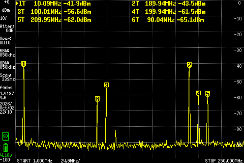
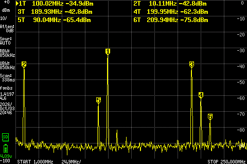

# Equipment

| Equipment | Description | Serial Number | Date of last calibration |
|-----------|-------------|---------------|--------------------------|
| Multimeter | Mastech M92 | 20011206033 | - |
| Multimeter | Fluke 8010A | 2047249 | - |
| Oscilloscope | Siglent SDS2354X HD |  SDS2HBAQ6R0257 | TBD |
| Power Supply | Siglent SPD3303C | SPD3EEEC6R0513 | TBD |
| Electronic Load | Siglent SDL1020X-E | SDL13GCC6R0182 | TBD |
| Spectrum Analyzer | ZeenKo ZS-406 | SU-406-25030820 | TBD |
| Function Generator | Siglent SDG2122X | SDG2XFBX901368 | TBD |

# Test Incident Reports

| Test | Incident | Proposed Solution | Status |
|------|----------|-------------------|--------|

# Diode ring mixer with transmission line transformer
LO-RF isolation can be measured by connecting the spectrum analyzer to the RF-port while terminating the IF-port with 50 ohm.

* LO-port : 100 MHz, 500 mVpp (-2 dBm)
* RF-port : 90 MHz, 10 mVpp (-36 dBm)

## Performance parameters
* Conversion loss : -36 - (-42) = 6 dB
* LO-RF isolation : -2 - (-49.2) = 47 dB
* LO-IF isolation : -2 - (-56.7) = 55 dB

<figure>

</figure>

## Sidestep : replacing TF2 by a short-circuit
TF2 is part of the transmission line transformer on the LO.  By replacing one leg with a short-circuit, LO break-through is 20 dB worse.  Clearly not a good idea to remove TF2.

<figure>

</figure>

## Cost : €1.54
* diode ring : €0.71 @ 1 pce
* CM-choke : 4x €0.21 = €0.84 @ 5 pcs
