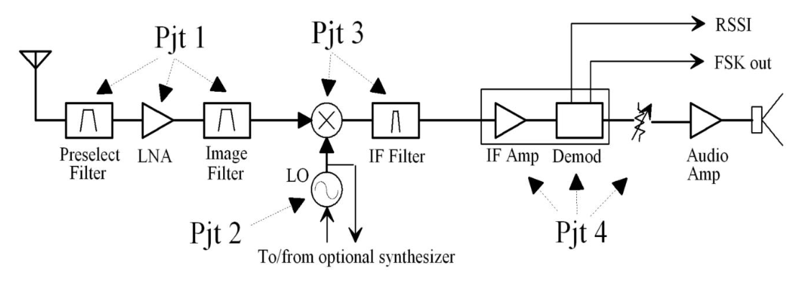

# Overview
This FM broadcast receiver is based on the ["Radio Design 101" YouTube series](https://www.youtube.com/watch?v=r_p7AHsSOdw&list=PL9Ox3wpnB0kqekAyz6blg4YdvoEMoJNJY).

The author of the series also has a [companion website](https://ecefiles.org/rf-design/) where you can find class notes, lab assignments, etc. 

<figure>
    
    <figcaption>FM broadcast receiver block diagram from the PDF-slides of the Radio Design 101 series</figcaption>
</figure>

# Power supply
Instead of a 9V battery, two Li-Ion cells in series will be used.  They'll be regulated down to 7V.

## Project 1: Tuned RF Amplifier and Image Filter 
* [Filter design](./Filters.ipynb)
* [Amplifier design](./amplifier.ipynb)

# Simple radio receiver
* [MikroE Superheterodyne FM Receivers](https://www.mikroe.com/ebooks/radio-receivers-from-crystal-set-to-stereo/superheterodyne-fm-receivers)
