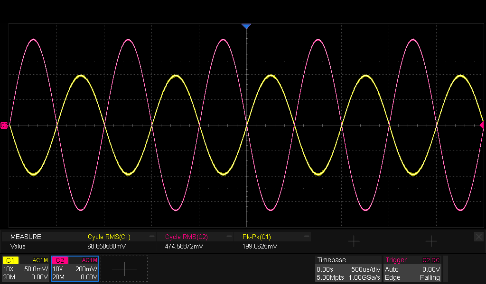
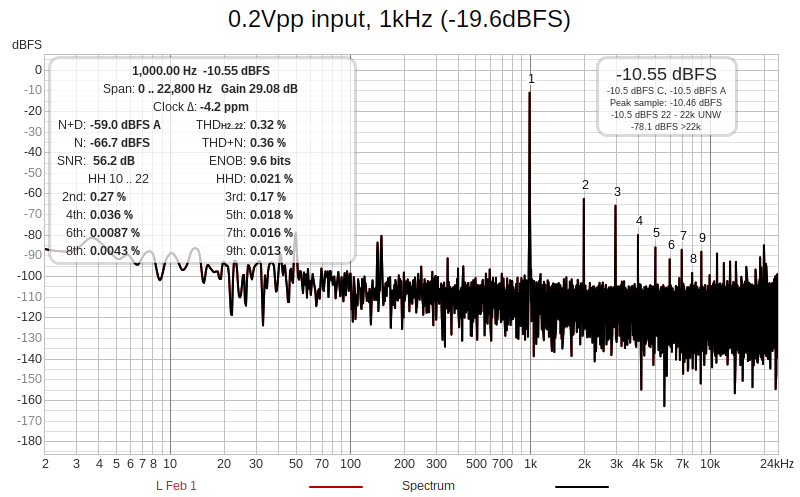
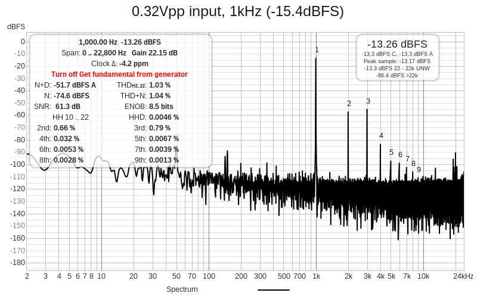
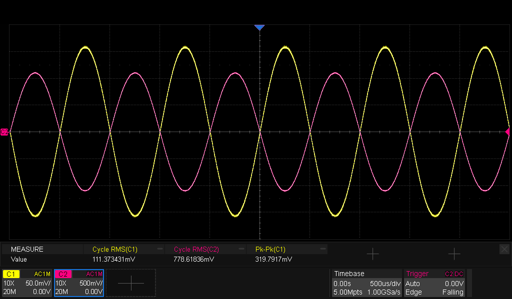
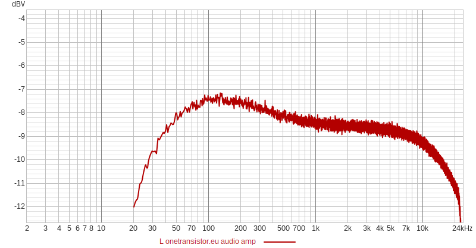

# Equipment

| Equipment | Description | Serial Number | Date of last calibration |
|-----------|-------------|---------------|--------------------------|
| Multimeter | Mastech M92 | 20011206033 | - |
| Multimeter | Fluke 8010A | 2047249 | - |
| Oscilloscope | Siglent SDS2354X HD |  SDS2HBAQ6R0257 | TBD |
| Power Supply | Siglent SPD3303C | SPD3EEEC6R0513 | TBD |
| Electronic Load | Siglent SDL1020X-E | SDL13GCC6R0182 | TBD |
| Spectrum Analyzer | ZeenKo ZS-406 | SU-406-25030820 | TBD |
| Function Generator | Siglent SDG2122X | SDG2XFBX901368 | TBD |

# Test Incident Reports

| Test | Incident | Proposed Solution | Status |
|------|----------|-------------------|--------|
| [TIR1](#tir1)<a id="ttir1"/> | Quiescent current is 3x higher than expected, although DC-bias voltages are ok. The transistors have much higher beta than in the simulation.| There's a fixed current regulation by the two series 1N4148.  That would have to be replaced by a current regulator, which adds complexity.  No action taken. | | 
| TIR2 | Lots of noise on incoming audio | decouple both incoming audio channels with 100nF each to GND|  |
| [TIR3](#tir3)<a id="ttir3"/> | Max output voltage at THD<1% is much lower than expected from simulation. | It's good enough for now | | |

# Test Results
| Action | Expected Result | Observed result | Status |
|--------|-----------------|-----------------|--------|
| Supply current at no load connected | 0mA| 0mA| ✅|
| Supply current at 8ohm connected (4x 33ohm/0.25W in parallel) | 11mA |34mA |🛑 [TIR1](#ttir1)<a id="tir1"/> |
| DC-current through the speaker | 2mA | 2mA| ✅|
| DC voltage Q5.B| 0.57V | 0.57V| ✅|
| DC voltage Q4.B| 1.84V | 1.83V| ✅|
| DC voltage Q3.B| 3.07V | 3.10V| ✅|
| DC voltage Q3.E| 2.46V | 2.46V| ✅|
| Measure amplification at 1kHz, 0.2Vpp in, 8ohm load | -1.33Vpp/200mVpp = -6.7 | -475mVrms/68.7mVrms = -6.9 | ✅|
| Measure THD at 1kHz, 0.2Vpp in, 8ohm load | <1% | 0.36% | ✅|
| Measure THD at 1kHz, 3Vpp out, 8ohm load | 0.60% | 1.67% | ✅|
| Measure max output voltage at 1kHz, 8ohm load, THD<1% | 3Vpp  | 779mVrms, 2.22Vpp | 🛑 [TIR3](#ttir3)<a id="tir3"/>|
| Measure frequency response at 0.2Vpp in, 8ohm load | 3dB from 20Hz to 20kHz | 30Hz to 15kHz 3dB bandwidth | ✅|

# Test Result Details
<figure>

<figcaption>Figure 1: C1 = 0.2Vpp input, C2 = Output signal at 1kHz, 8ohm load</figcaption>
</figure>

<figure>

<figcaption>Figure 2: RTA measurement at 1kHz, 0.2Vpp input, 8ohm load</figcaption>
</figure>

<figure>

<figcaption>Figure 3: RTA measurement at 1kHz, 0.32Vpp input, 8ohm load</figcaption>
</figure>

<figure>

<figcaption>Figure 4: C1 = 0.32Vpp input, C2 = Output signal at 1kHz, 8ohm load</figcaption>
</figure>

<figure>

<figcaption>Figure 5: Frequency response at 0.2Vpp input, 8ohm load</figcaption>
</figure>