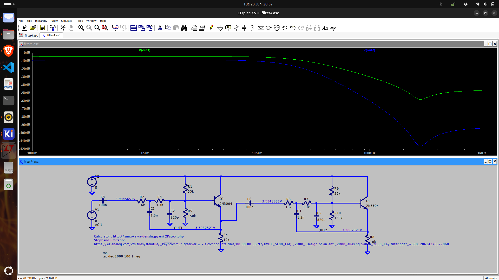

# Purpose
The output of the pulse counting detector is a PPM signal.  It should be low pass filtered (20 kHz) before sending it off to the audio amplifier.

# Schematic
<figure>

<figcaption>AC-small signal simulation</figcaption>
</figure>

# Implementation
It was once again Alan Yates' design with a Sallen-Key low pass filter, implemented with a BJT who provided the inspiration.  

Alan's design wasn't very optimized.  Using an [online filter design tool]((http://sim.okawa-denshi.jp/en/OPstool.php)) better values have been selected.  The ARRL 2018 Handbook contains design equations for active RC filters in §10.4.3.

# References
* [Alan Yates' Laboratory - Pulse-Counting FM Broadcast Receiver](../detector/doc/pulsecount/Alan%20Yates'%20Laboratory%20-%20Pulse-Counting%20FM%20Broadcast%20Receiver.pdf)
* [Okawa Electric Design : (Sample)Sallen-Key Low-pass Filter Design Tool - Result](http://sim.okawa-denshi.jp/en/OPstool.php)
* [KWIK CIRCUIT FAQ : Design of an anti-aliasing Sallen-Key filter by Marie-Eve Carré](./doc/KWIK_FAQ%20-%20Design%20of%20an%20anti-aliasing%20Sallen-Key%20filter.pdf)