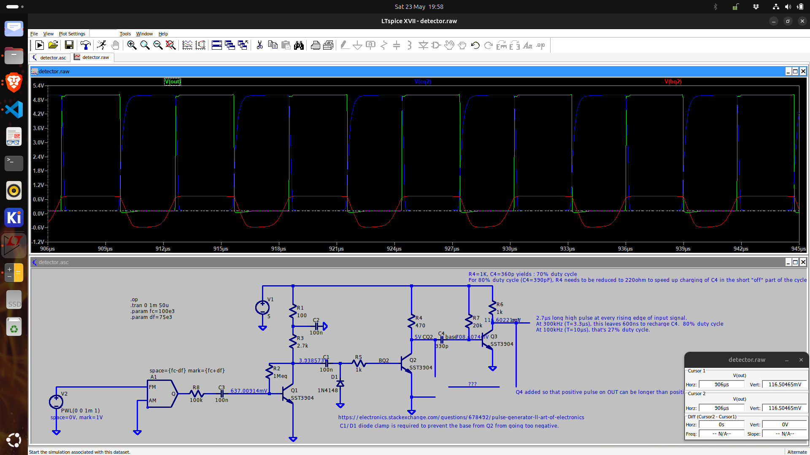
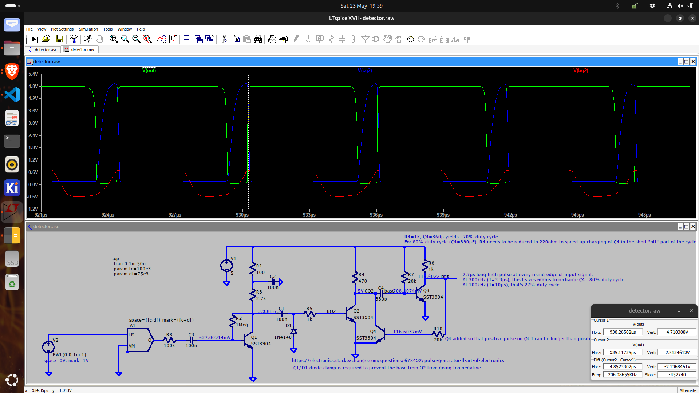

# Pulse Counting Discriminator
## Advantages
* inherently low distortion
* high dynamic range
* a frequency response to DC
* no need for tuned circuits
* The IF2-amplifier preceding the detector can be very simple as the IF2 frequency is low (a few hundred kHz).  This simplifies the design of the IF amplifier.

## Disadvantages
* It requires a mixer stage to convert the RF (single conversion superhet)  or IF (double conversion superhet) to a lower IF frequency (e.g. 100kHz).

## Optimization
* The IF frequency (f_c) should be as low as possible, to maximize the sensitivity of the discriminator.  However, it should be high enough so that the filter order for the audio low pass filter can be relaxed.  A common choice is around 100 to 200kHz.  
* Δf - f_c should be higher than the maximum audio frequency (15kHz) to avoid distortion.  This means that the IF frequency should be at least 90kHz (75kHz + 15kHz).
* The output duty cycle should be as close as possible to 100% at f_c + Δf = 175kHz.  So the maximum pulse width should be 1/175kHz = 5.7µs.

## Design
The IF amplifier is modified from Alan Yates' design.  The pulse generator circuit is from AoE 3rd Edition, page 78, fig. 2.12.

The length of the positive pulse at the output of the discriminator is determined by the charging of C4 through R7.  This pulse length must remain constant.  

The length of the negative pulse is determined by the discharge of C4 through R4.  Discharge should be fast to allow for high duty cycles.

<figure>
  
  <figcaption>Pulse counting discriminator without pulse elongation</figcaption>
</figure>
As soon as V(BQ2) drops below 0.6V, the positive pulse at the output V(out) ends.  Maximum duty cycle is limited to 50%.

<figure>
  
  <figcaption>Pulse counting discriminator with pulse elongation</figcaption>
</figure>
Maximum duty cycle is increased to 84% by adding a pulse elongation circuit.  Q4 prevents collector of Q2 to rise until C4 has fully charged to bring Q3 into conduction.  This prevents that the pulse width is shortened at higher frequencies.

## Reference
* [Pulse Generator - LL Art of Electronics](https://electronics.stackexchange.com/questions/678492/pulse-generator-ll-art-of-electronics)
  * AoE 3rd Edition, page 78, fig. 2.12
* [Solid State Pulse Counting FM Receiver](https://www.cool386.com/sspcrx/sspcrx.html)
  * 12 V supply
  * nice addition of signal strength indicator.
  * single conversion receiver to 200 kHz IF
  * pulses are only about 350 ns wide, which causes only a small duty cycle variation with frequency.
* [Armstrong microFM](https://www.cool386.com/armstrong_pcrx/armstrong_pcrx.html)
  * no RF-amplifier
  * works on 1.5V
  * antenna is inductor of mixer/oscillator stage
  * 80 kHz IF
* [Phil's Valve Radio site : Double Conversion Pulse Counting FM Superhet Receiver With 10.7 MHz First IF Stage](https://www.philsvalveradiosite.co.uk/doubleconversionpulsecountingfmtuner_1.htm) :
  * IF1 mixer : 10.7MHz out, dual gate MOSFET mixer
  * IF1 mixer directly into a 2nd mixer (no crystal filter on 10.7MHz!): 150kHz out
  * IF2 mixer followed by IF2-amplifier
  * IF2-amplifier followed by pulse counting discriminator
  * 420 ns pulse width
* [W2AEW : 303: What is a Pulse Counting FM Demodulator | Detector | Discriminator? ](https://www.youtube.com/watch?v=jQlN2fc7LJc)
  * single conversion superhet : 100MHz RF, 100.1MHz LO, 100kHz IF -> doesn't reject image, but there aren't none when using a signal generator.
  * 100kHz pulse counting discriminator
  * DBM with 1N4148
  * pulse width is about 1 µs
* [Alan Yates (VK2ZAY) 2014: Advent Calendar of Circuits 2014: Day 15: Pulse-Counting WBFM Receiver](https://www.youtube.com/watch?v=lP3HltRJV6A)
  * single conversion superhet : 100MHz RF, 100.1MHz LO, 150kHz-180kHz IF
  * J310 JFET mixer
  * 150kHz-180kHz IF amplifier (which will oscillate without proper input signal)
  * Remarks : it's not very sensitive (would be better with parallel RLC at the gate of the mixer), and it's not very selective, but still better than a super-regenerative receiver.
* [Alan Yates (VK2ZAY) 2010: Pulse-Counting FM Broadcast Receiver](http://www.vk2zay.net/article/250), [offline version](./doc/Alan%20Yates'%20Laboratory%20-%20Pulse-Counting%20FM%20Broadcast%20Receiver.pdf)
  * single conversion superhet : 100kHz IF
  * 2N5484 JFET mixer
  * IF amplifier (for 100kHz IF)
* [kvdijken Pulse Counting FM Detector](https://github.com/kvdijken/FM-Receiver/blob/main/documentation/Pulse%20Counting%20FM%20Detector.pdf) : uses a 2N3819 JFET mixer
  * IF1 mixer : 10.7MHz out
  * IF1 amplifier & limiter
  * IF2 mixer : 450kHz out
  * about 1 µs pulse width
* [forum](https://www.circuitsonline.net/forum/view/99082#highlight=discriminator)