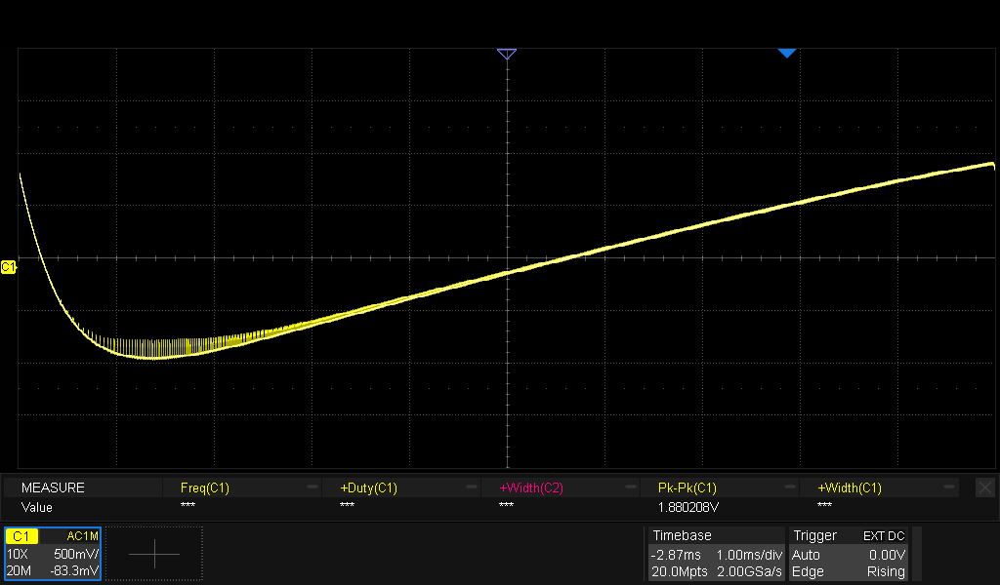
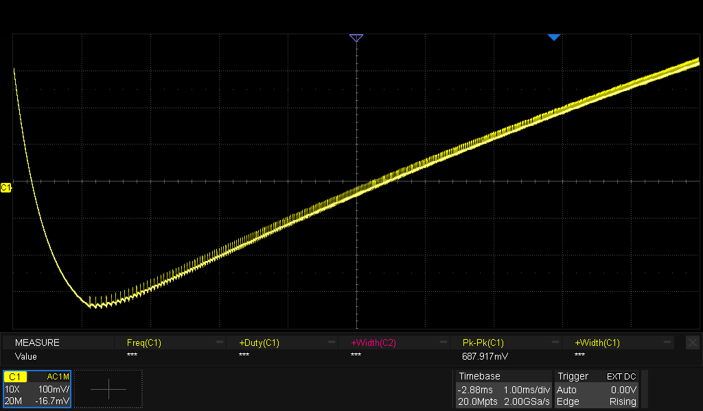

# Equipment

| Equipment | Description | Serial Number | Date of last calibration |
|-----------|-------------|---------------|--------------------------|
| Multimeter | Mastech M92 | 20011206033 | - |
| Multimeter | Fluke 8010A | 2047249 | - |
| Oscilloscope | Siglent SDS2354X HD |  SDS2HBAQ6R0257 | TBD |
| Power Supply | Siglent SPD3303C | SPD3EEEC6R0513 | TBD |
| Electronic Load | Siglent SDL1020X-E | SDL13GCC6R0182 | TBD |
| Spectrum Analyzer | ZeenKo ZS-406 | SU-406-25030820 | TBD |
| Function Generator | Siglent SDG2122X | SDG2XFBX901368 | TBD |

# Test Incident Reports

| Test | Incident | Proposed Solution | Status |
|------|----------|-------------------|--------|
| [TIR1](#tir1)<a id="ttir1"/> | R21 is too high When choosing small values for R18, Q6 will not conduct enough when R21 is 20K | Change R21 from 20K to 10K |  |
| [TIR2](#tir2)<a id="ttir2"/> | The pulse width is too long.  This limits the maximum frequency | Change C18 from 330 pF to 150 pF |  |

# Test Results
| Action | Expected Result | Observed result | Status |
|--------|-----------------|-----------------|--------|
| Q4.B | 0.64 V | 0.656 V | ✅ |
| Q4.C | 3.94 V | 3.31 V | ✅ |
| Q5.C | 5.0 V | 4.97 V | ✅ |
| Q7.B | 0.70 V | 0.717 V | ✅ |
| Q7.C | 0.12 V | 0.099 V | ✅ |
| Minimum input voltage on LF (left side of R13) for regular pulses on PWM_AUDIO | ? | 230 mVpp | ? |
| Positive pulse width on PWM_AUDIO | 4.86 µs | 3.47 µs | ? |
| Maximum duty cycle on PWM_AUDIO | 84% | 70% | ? |
| Maximum frequency on PWM_AUDIO before pulses collide | ? | 200 kHz | ? |
| Maximum center frequency with f_deviation of 75kHz | ? | 100 kHz | ? |

# Test Result Details
It's not very clear what the expected performance of the pulse counting discriminator should be.  

Anyway, some things have been done to improve performance, and the results are as follows:
* input amplitude on LF set to 300mVpp, then maximum frequency of the pulses is 234 kHz and the duty cycle is 78%.  The following changes have been made to achieve this:
  * R18 reduced from 470E to 330E
  * R21 reduced from 20K to 10K
  * 1N4148 patched parallel to R21 (cathode to PWM_AUDIO, anode to base of Q6)

## A failed attempt to increase the duty cycle
A higher duty cycle can be achieved by reducing C4, but R7 has to be increased to keep the positive pulse width constant. 

* Change C18 from 330 pF to 150 pF
* Change R19 from 20K to 43 K

With input amplitude on LF set to 300mVpp, then maximum frequency of the pulses is 192 kHz and the duty cycle is 80%.  This isn't any better than before, so the changes have been reverted.

After reverting, the max. frequency is 211 kHz and the duty cycle is 79%.

## After looking at other designs
Most other designs have pulse widths of about 1 µs.  Let's change C18 from 330 pF to 150 pF.
The pulse width is now 1.9 µs and the maximum frequency is 330 kHz

<figure>
  
  <figcaption>S-curve (1 Hz to 300 kHz), 10 ms sweep time</figcaption>
</figure>
The first 2 ms of the sweep should be ignored.  These are the transient response of the circuit.  After that, the S-curve is more or less linear up to 300 kHz.
The sweep time has been set to 10 ms instead of 50 ms.  At 10 ms, the S-curve is more linear.

<figure>
  
  <figcaption>S-curve (1 Hz to 100 kHz), 10 ms sweep time</figcaption>
</figure>
This detail shows that the S-curve is ok below 100 kHz as well.