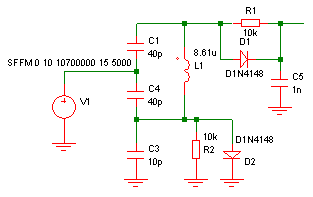

# Weiss discriminator
Jessop : p4.32 Receiver, fig. 82 : Weiss discriminator
[praktische vraagjes superhet](https://www.circuitsonline.net/forum/view/86845/2?mode=or&query=fm+antenne)

* hard to get a low distortion at the output.  THD below 0.5% is difficult to achieve.
* simple to build, no tapped inductor
* doesn't require 2nd stage mixer, so lower parts count
* requires amplification at 10.7MHz IF, before going into the discriminator
