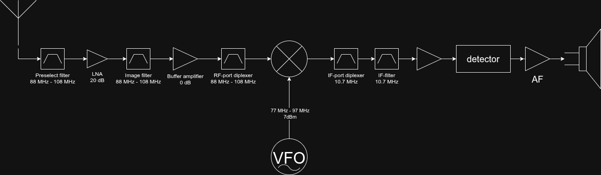

# Block diagram

<figure>
    
    <figcaption>Block diagram of the FM broadcast receiver</figcaption>
</figure>

* Input RF level : -110 dBm (weak signal) to -10 dBm (strong signal)

# References
* [High Performance Receiver Design - Radio Design 401, Episode 5](https://youtu.be/cplrp_Ev8ig?t=1530)