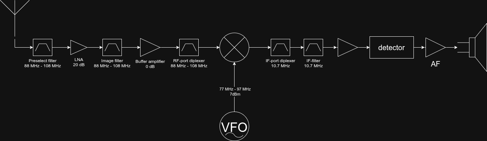

# Block diagram

<figure>
    
    <figcaption>Block diagram of the FM broadcast receiver</figcaption>
</figure>

* Input RF level : -110 dBm (weak signal) to -10 dBm (strong signal)

# Architecture
A modular approach has been selected.  Modules can be upgraded later on (will likely never happen) without having to redesign the whole radio.  The preferred approach for EMC purposes is to have a backplane in which the modules plug in.  As such, each module has a direct connection to the chassis.  The modules are perpendicular to the backplane.  There are at least two problems with this approach:
1. It takes up a lot of volume.  Space is limited in many applications.
2. It's hard to find a cheap way to mechanically keep the module into place on the backplane.

The alternative approach is to mount the modules parallel to the backplane.  The preferred solution is to mount the modules next to each other.  This might again not be possible due to space constraints.  

The worst solution is then to mount the modules on top of each other onto a backplane.  That approach is chosen here.  The added disadvantage is that signals needed for the topmost board only need to be passed through all of the boards below it.

The design will consist of at least three modules and a backplane.

## RF module
This module filters the RF-signals from the antenna, mixes them down to the IF-frequency and filters them.

## IF module
This module demodulates the signal at IF-frequency and turns it into an audio frequency

## LF module
This is an FM-desynthesis circuit, followed by an audio amplifier.

## Backplane
The backplane will hold the modules mentioned above as well as a potentiometer for tuning and one for volume control.  The backplane will also serve as cover plate for the radio.

# References
* [High Performance Receiver Design - Radio Design 401, Episode 5](https://youtu.be/cplrp_Ev8ig?t=1530)