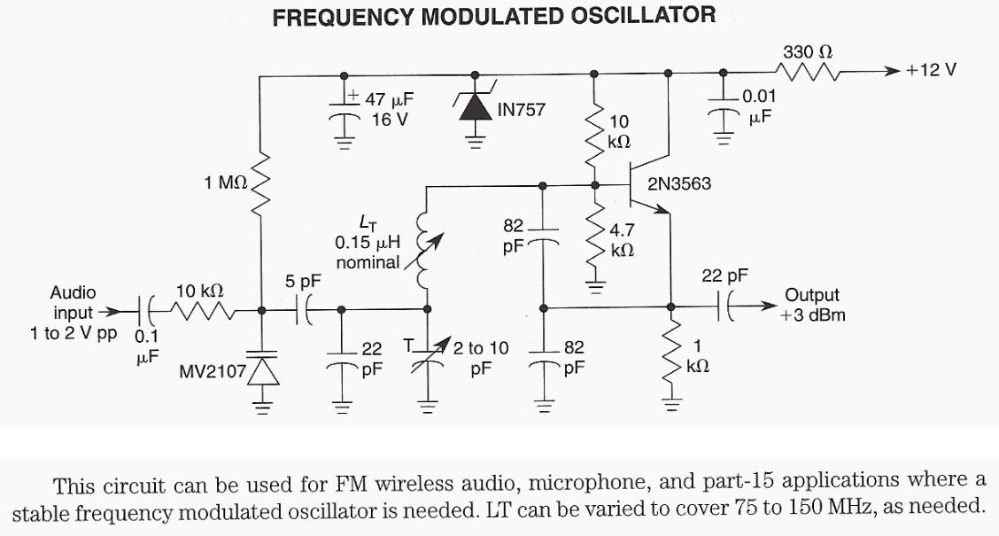

# References

## Common Base Colpitts and Clapp Oscillators
* [184N. Oscillator general topology, large signal Gm, amplitude and frequency calculation](https://www.youtube.com/watch?v=L7uazLiHC7o)
  * general derivation of oscillator frequency and amplitude
* [LC Oscillators | Intro to Analog Design | Harvey Mudd College | Video 25.2](https://www.youtube.com/watch?v=QcbPoFww6cg)
  * monotonous voice
  * peculiar way of doing the small signal analysis
* [MegaWattKS Semester Project - Radio Design 401, Episode 7](https://youtu.be/-rBG8U4wsOk?t=1972): not much info, no component values
  * [common base Colpitts oscillator](./doc/Common-Base-Oscillator-Design-07june2023-1.pdf), of which the original dirty version is [Oscillator design](./doc/010_Oscillators_and_VCOs.pdf).
* [Oscillator Circuits: Types, Analysis, and Performance Factors](https://studylib.net/doc/18253023/chapter-6.-oscillator)
  * collpitts and clapp
* [Activity: The Clapp Oscillator](https://wiki.analog.com/university/courses/electronics/comms-lab-clapp-osc)
  * includes design example with component values
* R.Quan : Build your own transistor radios 
  * common base configuration
  * not too much detail

## Common Collector Colpitts and Clapp Oscillators
* [#96: Analysis & Design of a Typical Colpitts Oscillator](https://www.youtube.com/watch?v=TSKq5l7uuz4):
  * very detailed analysis
  * includes design example with component values
* [devTtyS0](https://www.youtube.com/watch?v=o-TFeAUumW8)
  * includes design example with component values
* [Oscillators for FM radio](https://www.edaboard.com/threads/oscillators-for-fm-radio.413247/)

<figure>
  
  <figcaption>Clapp oscillator</figcaption>
</figure>

## Common Emitter Colpitts Oscillators
* [Colpitts Oscillator Report](https://github.com/AniruthSuresh/Colpitts-Oscillator/blob/main/Report.pdf)
  * includes design example with component values
* [Colpitts Oscillator Circuit Analysis (7 - Oscillators)](https://youtu.be/ES-kcNR4Ln0)
  * includes analysis and design example with component values
* [Understanding VCO Concepts](https://blog.minicircuits.com/understanding-vco-concepts/) & [AN95-007](https://www.minicircuits.com/appdoc/AN95-007.html)
  * common collector Colpitts oscillator : load on collector does not affect oscillation frequency
  * common base Colpitts oscillator : better for high frequency operation

* [Colpitts Oscillators](https://www.electronics-tutorials.com/oscillators/colpitts-oscillators.htm)
 * Clapp oscillator
 * JFET version
* [HF/VHF/UHF TEST OSCILLATOR](http://www.cappels.org/dproj/bandswitchtestosc/bs_test_oscillator.html)
  * uses JFETs
* Hayward IRFD
  * "Figure 7.8 The Clapp variation of the Colpitts oscillator"
  * Deep-dive mathematical analysis with Y-parameters
  * Analysis is done using common base configuration
  * Common collector configuration : practical and experimentally interesting : 
    * series resistor might be added between collector and Vcc : provides output that is well isolated from the rest of the circuit
* [Zetex Applications Note 9](./doc/an9.pdf)
  * fig. 9 : common collector clapp oscillator on page 8.

<figure>
  
  <figcaption>Clapp Oscillator Using BJT</figcaption>
</figure>

* Less interesting: 
  * Jessop, p.85 : oscillator design
  * [Clapp oscillator explained](https://everything.explained.today/Clapp_oscillator/)
  * [Clapp oscillator - TIDJMA](https://www.tidjma.tn/fr/electrical/clapp-oscillator-/)
  * [The Clapp Oscillator - and How! February 1953 QST](https://www.rfcafe.com/references/qst/clapp-oscillator-february-1953-qst.htm)